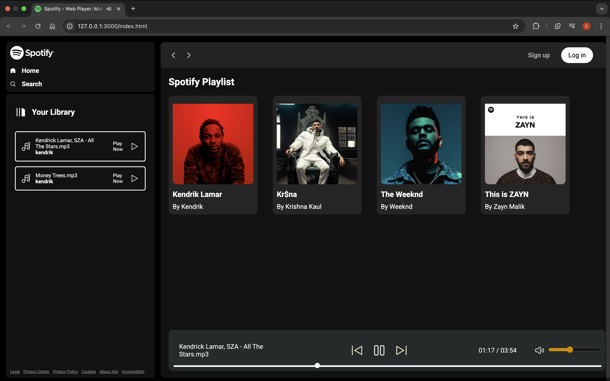
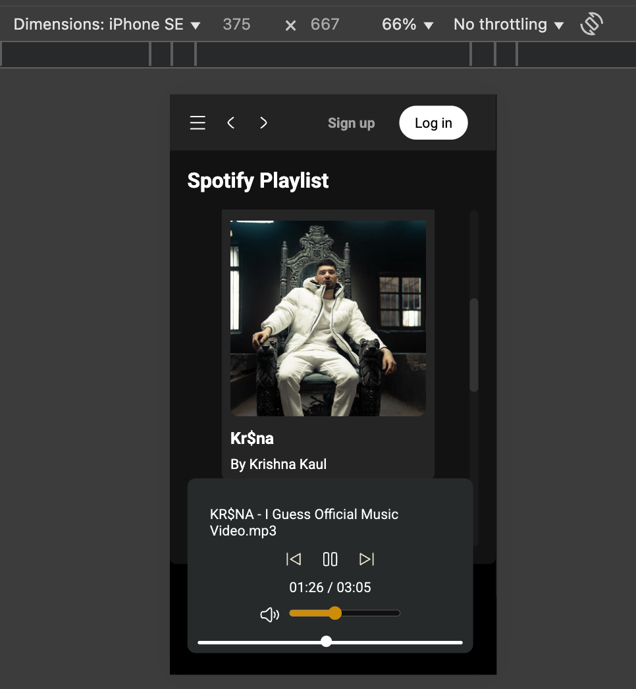

# 🎵 Responsive Spotify Clone 

## 📜 Project Description
This project is a **responsive clone of Spotify**, designed to mimic the core functionalities of the popular music streaming platform. It categorizes songs based on artists, with each artist having a dedicated library containing their respective songs. The website is built with a user-friendly interface and responsive design for seamless usability across devices.

## ✨ Features
- **Responsive UI**: Adapts to different screen sizes for a smooth experience.
- **Artist-based Song Categorization**: Songs are stored in folders based on artists.
- **Dynamic Navigation**: Users can browse through different artist library easily.
- **JavaScript Functionality**: Enhances interactivity with `script.js`.
- **Spotify-like Interface**: Replicates the layout and features of Spotify.

## 🛠️ Technologies Used
- **HTML**: Structuring the web pages.
- **CSS**: Styling using `style.css` and `utility.css`.
- **JavaScript**: Implementing interactive features via `script.js`.

## 🖼️ Screenshots




## 🚀 How to Run  
1. Clone the repository:  
   ```bash
   git clone https://github.com/chetan-1306/Responsive-Spotify.git
2. Open `index.html` in a web browser.
3. Ensure that the `Songs/` folder is properly structured with artist subfolders.

## 🔮 Future Improvements
- Add a search functionality to find songs quickly.
- Integrate a backend for user playlists and song recommendations.

## 📜 License
This project is open-source and can be modified as needed.

## 🤝 Contribution
Feel free to contribute and improve this project!

